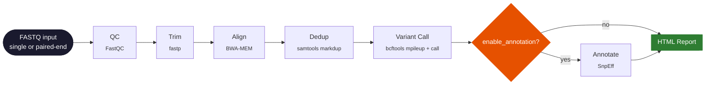
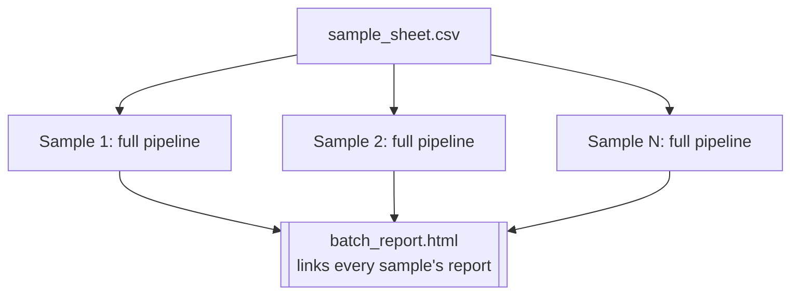

<div align="center">

# 🧬 NGS Data Processing Pipeline

**An end-to-end Next-Generation Sequencing pipeline** — QC, trimming, alignment,
duplicate marking, variant calling, optional annotation, and HTML reporting —
for single samples or multi-sample batches.

[](https://github.com/AmirShazad1/NGS-workbench/actions/workflows/tests.yml)
[](https://github.com/AmirShazad1/NGS-workbench/actions/workflows/lint.yml)
[](https://www.python.org/)
[](LICENSE)
[](https://github.com/psf/black)

</div>

---

## Table of contents

- [Why this exists](#why-this-exists)
- [Pipeline architecture](#pipeline-architecture)
- [Features](#features)
- [Install](#install)
- [Quick start](#quick-start)
- [Configuration reference](#configuration-reference)
- [CLI reference](#cli-reference)
- [Output layout](#output-layout)
- [Web UI](#web-ui)
- [Docker](#docker)
- [Repository layout](#repository-layout)
- [Testing & CI](#testing--ci)
- [License](#license)

---

## Why this exists

This started as a rebuild of a basic reference NGS pipeline. That version
worked for the simplest case but had real gaps: no paired-end support, a
`min_depth` setting that was accepted but silently never applied, a
duplicate-marking step that didn't exist, a hardcoded genome build for
annotation, and binary outputs committed straight into git.

Every one of those is fixed here, plus new stages (trimming, dedup, batch
mode) and a hardened web UI.

## Pipeline architecture



Every stage past QC is independently toggleable
(`trimming_enabled`, `dedup_enabled`, `enable_annotation`, `skip_qc`), and
every stage has its own module under `pipeline/stages/` with mocked-subprocess
unit tests — no bioinformatics tools required to run `pytest`.

**Batch mode** runs that same flow once per row of a CSV sample sheet:



## Features

| Stage | Tool | Toggle | Notes |
|---|---|---|---|
| QC | FastQC + custom stats | `skip_qc` | gzip-transparent FASTQ parsing |
| Trim | fastp | `trimming_enabled` | single- and paired-end |
| Align | BWA-MEM | — | paired-end aware; skips re-indexing if the reference is already indexed |
| Dedup | samtools markdup | `dedup_enabled` | sort→fixmate→sort→markdup→index |
| Variant call | bcftools mpileup + call | — | depth-filtered via `min_depth` |
| Annotate | SnpEff | `enable_annotation` | genome build from config, not hardcoded; falls back gracefully if SnpEff isn't installed |
| Report | Jinja2 → HTML | — | per-sample + combined batch report |
| Batch mode | CSV sample sheet | `run-batch` CLI command | per-sample config overrides, combined report |
| Web UI | Flask | optional | upload validation, optional API-key auth, SQLite job store |

## Install

Requires Python 3.8+. Real pipeline runs additionally need the Linux tools
`fastqc`, `bwa`, `samtools`, `bcftools`, `fastp`, `tabix` (and optionally
`snpEff`) — these are Linux-only, so on Windows use WSL2 or Docker.

```bash
git clone https://github.com/AmirShazad1/NGS-workbench.git
cd NGS-workbench
python3 -m venv venv
source venv/bin/activate
pip install -e .
pip install -r requirements.txt

# Linux / WSL2:
sudo apt-get install -y fastqc bwa samtools bcftools fastp tabix
```

## Quick start

Generate small synthetic test data — no real genome download needed:

```bash
python tools/generate_test_data.py data
```

Run a single sample:

```bash
ngs-pipeline run --config config/sample_config.yaml --output results/
```

Run a batch of samples from a sample sheet:

```bash
ngs-pipeline run-batch --config config/batch_config.yaml \
  --sample-sheet config/sample_sheet_example.csv --output results/
```

## Configuration reference

Single-sample config (`config/sample_config.yaml`):

| Field | Default | Meaning |
|---|---|---|
| `fastq_input` | — | Single-end reads. Mutually exclusive with `fastq_r1`/`fastq_r2` |
| `fastq_r1` / `fastq_r2` | — | Paired-end reads |
| `reference_genome` | — | Reference FASTA (**required**) |
| `output_dir` | `./results` | Output directory (**required**) |
| `threads` | `4` | Threads passed to bwa/fastp |
| `align_tool` | `bwa` | Must be `bwa` (validated against a supported set) |
| `variant_caller` | `bcftools` | Must be `bcftools` (validated against a supported set) |
| `min_depth` | `10` | Variants below this read depth are filtered out |
| `genome_build` | `hg38` | SnpEff genome DB, used only if `enable_annotation: true` |
| `trimming_enabled` | `true` | fastp adapter/quality trimming |
| `dedup_enabled` | `true` | samtools markdup duplicate marking |
| `fastqc_enabled` | `true` | Run FastQC during the QC stage |
| `skip_qc` | `false` | Skip the QC stage entirely |
| `enable_annotation` | `false` | Requires SnpEff; falls back gracefully if absent |

Batch mode (`config/batch_config.yaml` + `config/sample_sheet_example.csv`):
the YAML holds shared defaults (everything above except per-sample fields);
the CSV provides `sample_id` plus per-sample `fastq_input`/`fastq_r1`/`fastq_r2`
and can override `reference_genome` or any other field per row.

## CLI reference

```text
ngs-pipeline run --config CONFIG.yaml --output OUTPUT_DIR
ngs-pipeline run-batch --config BASE_CONFIG.yaml --sample-sheet SHEET.csv --output OUTPUT_DIR
```

## Output layout

```text
results/
├── aligned.bam            # sorted, indexed alignment
├── dedup.bam              # duplicate-marked alignment (if dedup_enabled)
├── variants.vcf.gz        # depth-filtered variant calls
├── annotated.vcf.gz       # annotated variants (if enable_annotation)
├── report.html            # self-contained per-sample summary
├── qc/                    # FastQC output
└── trimmed/                # fastp output + report (if trimming_enabled)

# batch mode additionally produces:
results/
├── <sample_id>/...        # each sample's own full output tree above
└── batch_report.html      # links every sample's report.html
```

## Web UI

A small Flask app for submitting jobs through a browser instead of the CLI —
upload a FASTQ + reference, pick options, and poll job status.

```bash
pip install -e ".[web]"
python -m web.app   # run as a module from the repo root
```

See **[web/README.md](web/README.md)** for the optional `NGS_API_KEY` auth
header and the SQLite job-store details.

## Docker

```bash
docker build -t ngs-pipeline:latest .
docker run -v $(pwd)/data:/app/data -v $(pwd)/results:/app/results ngs-pipeline:latest \
  run --config /app/config/sample_config.yaml --output /app/results/docker_run
# or:
docker-compose up
```

## Repository layout

```text
pipeline/
├── stages/        # one module per pipeline step (qc, trim, align, dedup, variant_call, annotate, report)
├── utils/         # config loading/validation, sample-sheet parsing, logging
├── workflows/     # orchestrates the stage sequence, single-sample + batch
└── main.py        # Click CLI entry point
web/               # Flask job-submission UI
tools/             # deterministic helper scripts (synthetic test data generator)
tests/             # one test module per pipeline stage, mocked subprocess calls
config/            # example single-sample and batch configs
```

## Testing & CI

```bash
pip install -e ".[dev]"
pytest -v --cov=pipeline
flake8 pipeline tools tests web
black --check -l 120 pipeline tools tests web
```

GitHub Actions runs the same checks on every push/PR (`.github/workflows/`),
plus a real end-to-end run against the synthetic test data using the actual
bioinformatics toolchain on the runner — not just mocked tests.

## License

[Apache License 2.0](LICENSE) — permissive: anyone can use, modify, and
redistribute this (including commercially), as long as the copyright/license
notice is kept and any changes are noted. Unlike MIT, it also includes an
explicit patent grant (contributors grant you a license to any patents they
hold that are necessarily infringed by their contribution, which lapses if
you sue over patents related to this code) and requires stating significant
changes made to modified files.

If you'd rather use a copyleft license (e.g. **GPL-3.0**/**AGPL-3.0**, which
require anyone distributing modified versions — or running it as a network
service, for AGPL — to also open-source their changes), swap out the
`LICENSE` file and the badge above.
